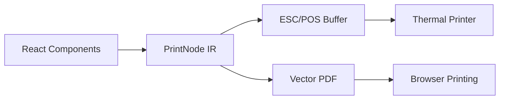

# Getting Started

@thermal-print is a modular TypeScript library suite for thermal printing with a clean, standalone architecture.

## Architecture Overview

**Clean separation of concerns:**

- **@thermal-print/core** - Universal `PrintNode` intermediate representation (IR)
- **@thermal-print/react** - React components + PrintNode converter + HTML converter
- **@thermal-print/escpos** - PrintNode → ESC/POS buffer converter
- **@thermal-print/pdf** - PrintNode → Vector PDF converter

## Which Package Do I Need?

| Use Case | Packages |
|----------|----------|
| Thermal printing with React | `@thermal-print/react` |
| Browser PDF printing | `@thermal-print/react` + `@thermal-print/pdf` |
| Advanced ESC/POS control | `@thermal-print/escpos` |
| Build custom adapter | `@thermal-print/core` |

## Next Steps

- [Installation](/guide/installation) - Install the packages
- [Packages](/packages/react) - Learn about each package
- [Playground](https://gmartinu.github.io/thermal-print/) - Try it live
