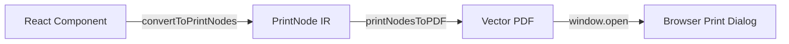
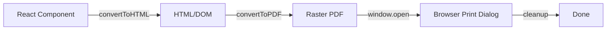

# @thermal-print/pdf

PDF generation for thermal printers. Supports both vector (recommended) and raster modes.

::: tip API Reference
For detailed API documentation, see the [@thermal-print/pdf API Reference](/api/pdf/).
:::

## Installation

```bash
pnpm add @thermal-print/pdf
```

## Exports

- `printNodesToPDF()` - PrintNode → Vector PDF (recommended)
- `convertToPDF()` - DOM → Raster PDF (legacy)

## Vector PDF (Recommended)

Uses native PDF text rendering for crisp, high-quality output.



```tsx
import { convertToPrintNodes } from '@thermal-print/react';
import { printNodesToPDF } from '@thermal-print/pdf';

// Convert React to PrintNode
const printNode = convertToPrintNodes(<Receipt />);

// Generate vector PDF
const result = await printNodesToPDF(printNode);

// Open in new window for printing
window.open(result.url);

// Clean up when done
result.cleanup();
```

## Raster PDF (Legacy)

Captures DOM as image. Lower quality but works with any HTML.



```tsx
import { convertToHTML } from '@thermal-print/react';
import { convertToPDF } from '@thermal-print/pdf';

// Step 1: Render React to DOM
const htmlResult = await convertToHTML(<Receipt />, {
  containerId: 'thermal-receipt',
  keepInDOM: true
});

// Step 2: Convert DOM to PDF
const pdfResult = await convertToPDF('thermal-receipt', {
  paperSize: '80mm',
  scale: 2
});

// Step 3: Open print dialog
window.open(pdfResult.url);

// Step 4: Cleanup
htmlResult.cleanup();
pdfResult.cleanup();
```

## Options

### printNodesToPDF Options

```tsx
interface VectorPDFOptions {
  // Paper width in points (default: 205pt ≈ 72mm)
  paperWidth?: number;

  // Paper height in points or 'auto' for dynamic
  paperHeight?: number | 'auto';

  // Default font size (default: 10)
  defaultFontSize?: number;

  // Line height multiplier (default: 1.2)
  lineHeight?: number;

  // Font family (default: 'Helvetica')
  fontFamily?: string;
}
```

### convertToPDF Options

```tsx
interface PDFOptions {
  // Paper size: 'A4', 'Letter', '80mm', '58mm', or custom
  paperSize?: string | { width: number; height: number };

  // Orientation: 'portrait' or 'landscape'
  orientation?: 'portrait' | 'landscape';

  // Render scale (default: 2)
  scale?: number;

  // Margin in mm (default: 10)
  margin?: number;

  // Auto-download filename
  filename?: string;
}
```

## Page Sizes

### Using Page Component

Set the size directly on the Page component:

```tsx
<Page size={{ width: 227, height: 300 }}>
  <Text>Fixed size receipt</Text>
</Page>
```

### Dynamic Height

For receipts that grow with content:

```tsx
<Page wrap={true}>
  <Text>Content flows naturally</Text>
</Page>
```

## Paper Size Reference

| Size | Points | Millimeters |
|------|--------|-------------|
| 58mm | 165pt  | 58mm        |
| 80mm | 227pt  | 80mm        |
| A4   | 595pt  | 210mm       |
