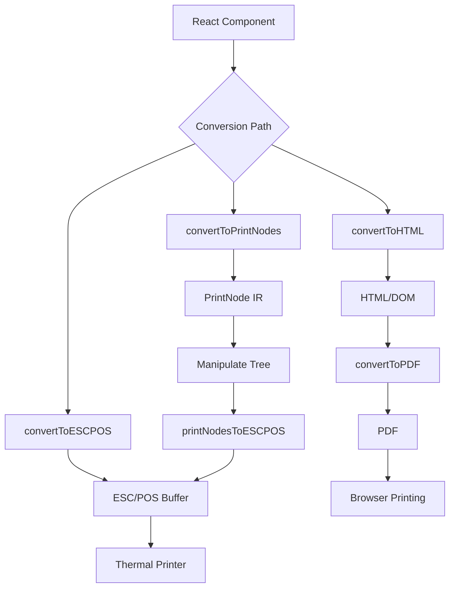

# @thermal-print/react

The main package for thermal printing with React. Provides components optimized for thermal printers with multiple output formats.

::: tip API Reference
For detailed API documentation, see the [@thermal-print/react API Reference](/api/react/).
:::

## Installation

```bash
pnpm add @thermal-print/react
# or
npm install @thermal-print/react
```

## Overview

This package provides React components specifically optimized for thermal printers, along with conversion utilities for both direct thermal printing (ESC/POS) and browser printing (HTML/PDF).

**Three conversion paths:**



| Path | Function | Use Case |
|------|----------|----------|
| React → ESC/POS | `convertToESCPOS()` | Direct thermal printer output |
| React → PrintNode IR | `convertToPrintNodes()` | Intermediate representation for manipulation |
| React → HTML/DOM | `convertToHTML()` | Browser rendering and PDF generation |

## Quick Start

### Basic Receipt

```tsx
import {
  Document,
  Page,
  View,
  Text,
  StyleSheet,
  convertToESCPOS,
} from "@thermal-print/react";

const styles = StyleSheet.create({
  header: {
    fontSize: 20,
    textAlign: "center",
    fontWeight: "bold",
  },
  row: {
    flexDirection: "row",
    justifyContent: "space-between",
  },
  divider: {
    borderBottom: "1px solid black",
    marginTop: 10,
    marginBottom: 10,
  },
});

function Receipt() {
  return (
    <Document>
      <Page>
        <Text style={styles.header}>MY STORE</Text>
        <View style={styles.divider} />

        <View style={styles.row}>
          <Text>Coffee</Text>
          <Text>$3.50</Text>
        </View>

        <View style={styles.row}>
          <Text>Muffin</Text>
          <Text>$2.00</Text>
        </View>

        <View style={styles.divider} />

        <View style={styles.row}>
          <Text style={{ fontWeight: "bold" }}>Total</Text>
          <Text style={{ fontWeight: "bold" }}>$5.50</Text>
        </View>
      </Page>
    </Document>
  );
}

// Convert to ESC/POS and print
const buffer = await convertToESCPOS(<Receipt />, {
  paperWidth: 48,
  cut: "full",
});

await printer.write(buffer);
```

### Browser Preview

```tsx
import { Preview, Document, Page, Text } from "@thermal-print/react";

function App() {
  return (
    <Preview paperWidth={48} showRuler>
      <Document>
        <Page>
          <Text>This is how it will print!</Text>
        </Page>
      </Document>
    </Preview>
  );
}
```

## Components

### Document

Root wrapper for thermal printer documents.

```tsx
<Document>
  <Page>...</Page>
</Document>
```

### Page

Semantic page wrapper. Thermal printers print continuously, so this is mainly for logical organization.

```tsx
<Page style={{ padding: 10 }}>
  <Text>Content</Text>
</Page>
```

**Props:**

| Prop | Type | Description |
|------|------|-------------|
| `children` | `ReactNode` | Page content |
| `style` | `ViewStyle` | Page styling |
| `size` | `{ width: number; height?: number }` | Page dimensions in points (for PDF) |
| `wrap` | `boolean` | Enable dynamic height (for PDF) |

### View

Layout container with flexbox support.

```tsx
// Column layout (default)
<View style={{ padding: 10 }}>
  <Text>Item 1</Text>
  <Text>Item 2</Text>
</View>

// Row layout (side-by-side)
<View style={{ flexDirection: 'row', justifyContent: 'space-between' }}>
  <Text>Left</Text>
  <Text>Right</Text>
</View>

// With borders (dividers)
<View style={{ borderBottom: '1px solid black' }} />
<View style={{ borderTop: '1px dashed black' }} />
```

**Props:**

| Prop | Type | Description |
|------|------|-------------|
| `children` | `ReactNode` | View content |
| `style` | `ViewStyle` | View styling |

### Text

Text content with styling.

```tsx
<Text style={{ fontSize: 20, textAlign: "center", fontWeight: "bold" }}>
  Hello World
</Text>
```

**Props:**

| Prop | Type | Description |
|------|------|-------------|
| `children` | `string` | Text content |
| `style` | `TextStyle` | Text styling |

### Image

Images are converted to monochrome for thermal printing.

```tsx
<Image
  src="data:image/png;base64,..."
  style={{ textAlign: 'center' }}
/>
```

**Props:**

| Prop | Type | Description |
|------|------|-------------|
| `src` | `string` | Image source (URL or base64 data URI) |
| `style` | `ImageStyle` | Image styling |

::: tip
For best results with thermal printers:
- Use high-contrast images
- Prefer base64 data URIs
- Keep images small (they're resized to fit paper width)
:::

### Preview

Visual preview component for development and testing.

```tsx
<Preview
  id="receipt-preview"
  paperWidth={48}
  showRuler
  scale={1.5}
>
  <Document>
    <Page>
      <Text>Preview content</Text>
    </Page>
  </Document>
</Preview>
```

**Props:**

| Prop | Type | Default | Description |
|------|------|---------|-------------|
| `id` | `string` | - | Container ID (useful for PDF conversion) |
| `paperWidth` | `number` | `48` | Characters per line |
| `showRuler` | `boolean` | `false` | Show character ruler at top |
| `scale` | `number` | `1` | Scale factor for preview size |
| `style` | `CSSProperties` | - | Additional CSS styling |

### StyleSheet

Utility for organizing styles (pass-through function).

```tsx
const styles = StyleSheet.create({
  header: { fontSize: 20, textAlign: 'center' },
  text: { fontSize: 12 },
  bold: { fontWeight: 'bold' },
  row: { flexDirection: 'row', justifyContent: 'space-between' },
});

<Text style={styles.header}>Title</Text>
```

### Font

Reserved for future use. Currently a no-op for thermal printers.

```tsx
// This is a no-op for thermal printers
Font.register({
  family: 'Roboto',
  fonts: [{ src: 'https://...' }],
});
```

## API Functions

### convertToESCPOS()

Converts React component directly to ESC/POS buffer.

```tsx
const buffer = await convertToESCPOS(<Receipt />, {
  paperWidth: 48,
  cut: 'full',
  feedBeforeCut: 3,
});
```

**Options:**

| Option | Type | Default | Description |
|--------|------|---------|-------------|
| `paperWidth` | `number` | `48` | Characters per line |
| `encoding` | `string` | `'utf-8'` | Character encoding |
| `debug` | `boolean` | `false` | Enable debug output |
| `cut` | `boolean \| 'full' \| 'partial'` | `'full'` | Paper cut after printing |
| `feedBeforeCut` | `number` | `3` | Lines to feed before cut |
| `commandAdapter` | `'escpos' \| 'escbematech'` | `'escpos'` | Protocol adapter |
| `adapter` | `ComponentMapping` | - | Custom component mapping |

**Returns:** `Promise<Buffer>`

### convertToPrintNodes()

Converts React component to PrintNode intermediate representation.

```tsx
import { convertToPrintNodes } from '@thermal-print/react';
import { printNodesToESCPOS } from '@thermal-print/escpos';

// Step 1: React → PrintNode
const printNode = convertToPrintNodes(<Receipt />);

// Step 2: Manipulate if needed
printNode.children.push({
  type: 'text',
  props: { children: 'COPY' },
  children: [],
  style: { textAlign: 'center' }
});

// Step 3: PrintNode → ESC/POS
const buffer = await printNodesToESCPOS(printNode);
```

**Returns:** `PrintNode | null`

### convertToHTML()

Converts React component to HTML/DOM for browser-based workflows.

```tsx
const result = await convertToHTML(<Receipt />, {
  containerId: 'thermal-receipt',
  keepInDOM: true,
  width: 400,
});

// result.content - HTMLElement or string
// result.cleanup() - Remove from DOM
```

**Options:**

| Option | Type | Default | Description |
|--------|------|---------|-------------|
| `width` | `number` | `400` | Container width in pixels |
| `applyThermalStyles` | `boolean` | `true` | Apply thermal styling |
| `format` | `'html' \| 'element'` | `'element'` | Return format |
| `containerId` | `string` | - | Custom container ID |
| `keepInDOM` | `boolean` | `false` | Keep in DOM after render |

**Returns:** `Promise<ConvertToHTMLResult>`

## Styling Guide

### Font Sizes

Font sizes map to thermal printer character sizes:

| fontSize | ESC/POS Size | Description |
|----------|--------------|-------------|
| 8-12px | 1x1 | Normal |
| 13-18px | 1x2 | Double height |
| 19-24px | 2x1 | Double width |
| 25+px | 2x2 | Double both (max) |

```tsx
<Text style={{ fontSize: 12 }}>Normal (1x1)</Text>
<Text style={{ fontSize: 16 }}>Tall (1x2)</Text>
<Text style={{ fontSize: 20 }}>Wide (2x1)</Text>
<Text style={{ fontSize: 28 }}>Large (2x2)</Text>
```

### Text Alignment

```tsx
<Text style={{ textAlign: 'left' }}>Left aligned</Text>
<Text style={{ textAlign: 'center' }}>Centered</Text>
<Text style={{ textAlign: 'right' }}>Right aligned</Text>
```

### Bold Text

```tsx
<Text style={{ fontWeight: 'bold' }}>Bold text</Text>
<Text style={{ fontWeight: 700 }}>Also bold</Text>
```

### Dividers

```tsx
// Solid line
<View style={{ borderBottom: '1px solid black' }} />

// Dashed line
<View style={{ borderTop: '1px dashed black' }} />
```

### Spacing

```tsx
<View style={{
  marginTop: 10,
  marginBottom: 10,
  paddingTop: 5,
  paddingBottom: 5
}}>
  <Text>Content with spacing</Text>
</View>
```

::: info
Spacing conversion: ~20 pixels ≈ 1 line feed
:::

### Row Layouts

```tsx
// Two-column layout (space-between)
<View style={{ flexDirection: 'row', justifyContent: 'space-between' }}>
  <Text>Item</Text>
  <Text>$10.00</Text>
</View>

// Centered row
<View style={{ flexDirection: 'row', justifyContent: 'center' }}>
  <Text>PAID</Text>
</View>

// Fixed-width columns
<View style={{ flexDirection: 'row' }}>
  <View style={{ width: '40%' }}><Text>Product</Text></View>
  <View style={{ width: '30%' }}><Text>Qty</Text></View>
  <View style={{ width: '30%' }}><Text>Price</Text></View>
</View>
```

## Style Reference

### ViewStyle

| Property | Type | Supported | Notes |
|----------|------|-----------|-------|
| `flexDirection` | `'row' \| 'column'` | ✅ | Default: column |
| `justifyContent` | `'space-between' \| 'center' \| 'flex-start' \| 'flex-end'` | ✅ | For row layouts |
| `alignItems` | `'center' \| 'flex-start' \| 'flex-end'` | ⚠️ | Text alignment fallback only |
| `padding` | `number` | ✅ | All sides |
| `paddingTop` | `number` | ✅ | Top padding |
| `paddingBottom` | `number` | ✅ | Bottom padding |
| `paddingLeft` | `number` | ❌ | Not supported |
| `paddingRight` | `number` | ❌ | Not supported |
| `margin` | `number` | ✅ | All sides |
| `marginTop` | `number` | ✅ | Top margin |
| `marginBottom` | `number` | ✅ | Bottom margin |
| `borderTop` | `string` | ✅ | e.g., '1px solid black' |
| `borderBottom` | `string` | ✅ | e.g., '1px dashed black' |
| `width` | `string \| number` | ✅ | For columns (e.g., '50%') |

### TextStyle

| Property | Type | Supported | Notes |
|----------|------|-----------|-------|
| `fontSize` | `number` | ✅ | Maps to 4 discrete sizes |
| `fontWeight` | `'bold' \| 'normal' \| number` | ✅ | 700+ = bold |
| `textAlign` | `'left' \| 'center' \| 'right'` | ✅ | Text alignment |
| `color` | `string` | ❌ | Monochrome only |
| `fontFamily` | `string` | ❌ | Fixed printer font |

## Advanced Usage

### Custom Component Adapter

Map your custom components to standard types:

```tsx
import { createAdapter, convertToESCPOS } from '@thermal-print/react';

const adapter = createAdapter({
  Receipt: 'document',
  Section: 'page',
  Row: 'view',
  Label: 'text',
  Logo: 'image'
});

const buffer = await convertToESCPOS(<Receipt />, {
  adapter,
  paperWidth: 48
});
```

### Different Printer Protocols

```tsx
// Standard ESC/POS (default)
const buffer = await convertToESCPOS(<Receipt />, {
  commandAdapter: 'escpos'
});

// Bematech printers
const buffer = await convertToESCPOS(<Receipt />, {
  commandAdapter: 'escbematech'
});
```

### Browser Printing with PDF

```tsx
import { convertToHTML } from '@thermal-print/react';
import { convertToPDF } from '@thermal-print/pdf';

async function handlePrint() {
  // Step 1: Render to DOM
  const htmlResult = await convertToHTML(<Receipt />, {
    containerId: 'thermal-receipt',
    keepInDOM: true,
  });

  // Step 2: Convert to PDF
  const pdfResult = await convertToPDF('thermal-receipt', {
    paperSize: '80mm',
    scale: 2,
  });

  // Step 3: Open print dialog
  window.open(pdfResult.url);

  // Cleanup
  htmlResult.cleanup();
  pdfResult.cleanup();
}
```

## Thermal Printer Constraints

### What Works

- Column layout (stacked vertically)
- Row layout (side-by-side columns)
- Text alignment (left, center, right)
- Bold text
- 4 font sizes (1x1, 1x2, 2x1, 2x2)
- Divider lines (solid and dashed)
- Monochrome images
- Vertical spacing (padding/margin)

### What Doesn't Work

| CSS Property | Reason |
|--------------|--------|
| `color` | Monochrome printers |
| `backgroundColor` | No background support |
| `position: absolute` | Line-by-line rendering |
| `transform` | No rotation/scaling |
| `borderRadius` | Character-based rendering |
| `paddingLeft/Right` | No horizontal margins |
| `fontFamily` | Fixed printer font |
| `lineHeight` | Fixed line spacing |

## Paper Width Reference

| Paper Size | Characters | Use |
|------------|------------|-----|
| 58mm | 32 | Small receipts |
| 80mm | 48 | Standard receipts (default) |
| 112mm | 64 | Wide receipts |

## Troubleshooting

### Text is cut off

Adjust `paperWidth` to match your printer:

```tsx
// 58mm printer
{ paperWidth: 32 }

// 80mm printer (default)
{ paperWidth: 48 }

// 112mm printer
{ paperWidth: 64 }
```

### Encoding problems (garbled text)

Try different encodings:

```tsx
{ encoding: 'cp860' }      // Portuguese
{ encoding: 'gb18030' }    // Chinese
{ encoding: 'iso-8859-1' } // Latin
```

### Images don't print

- Use base64 data URIs
- Ensure high contrast
- Keep images small
- Test with monochrome images first

### Bold not showing

Verify you're using:
- `fontWeight: 'bold'`
- `fontWeight: 700` (or higher)

Not `fontWeight: 600` or `fontWeight: 'medium'`.

## Migration from @react-pdf/renderer

See the [Migration Guide](/guide/migration) for detailed instructions on migrating from `@react-pdf/renderer`.

**Quick comparison:**

| @react-pdf/renderer | @thermal-print/react |
|---------------------|----------------------|
| `PDFViewer` | `Preview` |
| `ReactPDF.render()` | `convertToESCPOS()` |
| `PDFDownloadLink` | `convertToHTML()` + `convertToPDF()` |
| `BlobProvider` | `convertToESCPOS()` (returns Buffer) |

## Related Packages

- [@thermal-print/core](/packages/core) - Core types and PrintNode IR
- [@thermal-print/escpos](/packages/escpos) - ESC/POS converter
- [@thermal-print/pdf](/packages/pdf) - PDF generation
